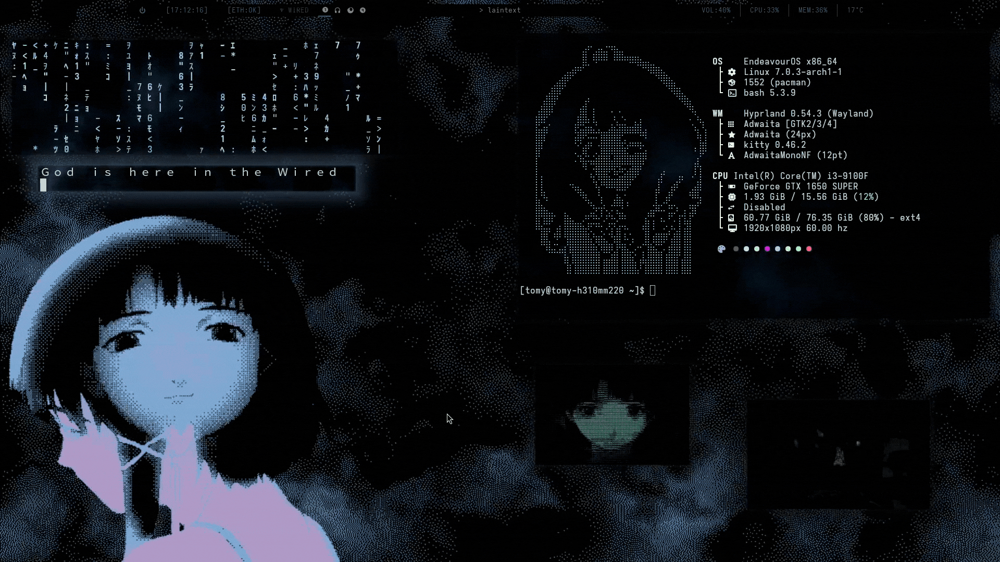
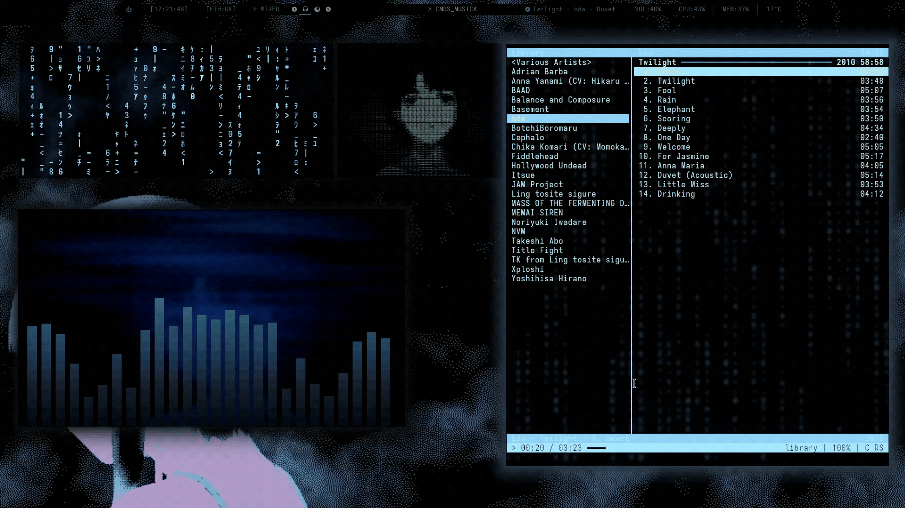

# Lain Rice by TomyQz
<p align="center">
  
  
</p>
<p align="center">
  <i>Visual showcase of the Hyprland rice.</i>
</p>

This is my personal rice for Linux, inspired by the aesthetic of Serial Experiments Lain.

## Prerequisites (Dependencies)
Before applying this rice, make sure you have the following programs installed:

Window Managers and Compositors

    Hyprland: The main Wayland compositor.

    Waybar: For the top bar.

Terminal Applications

    Kitty: The terminal emulator.

    Fastfetch: An ultra-fast command-line tool

    Cmus: Terminal-based music player. (optional)

    Cava: Audio visualizer.

Visual Effects

    Unimatrix: For the Matrix/Lain-style code rain effect.

    MPV: To play the lain windows .webm

## Installation Command (Arch Linux)

To install all the necessary dependencies for the rice, run the following command:
```bash
sudo pacman -S hyprland waybar kitty cava mpv fastfetch
```
Note: Unimatrix is usually found in the AUR. You can install it using an AUR helper like yay or paru:
Bash
```
yay -S unimatrix-git

```
## SDDM Theme
Please make sure you have the following dependencies installed:
```bash
sudo pacman -S qt5-quickcontrols2 qt5-graphicaleffects qt5-svg qt5-multimedia gst-libav gst-plugins-good gst-plugin-openh264
```
This link is the one I used to download the SDDM theme: https://github.com/leonardochappuis/sddmsel. I have included the theme in the dotfiles folder anyway, but the creator's GitHub has clear installation instructions.

## Installation

    Clone this repository:
    git clone https://github.com/TomyQz/Lain-Rice.git

   Warning: Do not copy the .config files directly to your system. These are configured specifically for my hardware and setup, so copying them without checking could cause errors. Use them as a reference to adjust your own configurations.

  The wallpaper is included in the main directory in high-quality GIF format. https://github.com/TomyQz/Lain-Rice/blob/main/Lain%20wallpaper%20wired.gif.

# Credits and Resources

  Wallpaper: created by me using assets from fauux website.

  SDDM Theme: sddmsel by leonardochappuis.

  inspiration: Major credits to the Hyprlain project (https://github.com/Ascaniolamp/Hyprlain) which served as the primary inspiration for this rice.

  Series: Based on the anime Serial Experiments Lain (1998).

# License
This project is licensed under the MIT License. You are free to use the dotfiles and the wallpaper, provided you maintain the appropriate credits.
